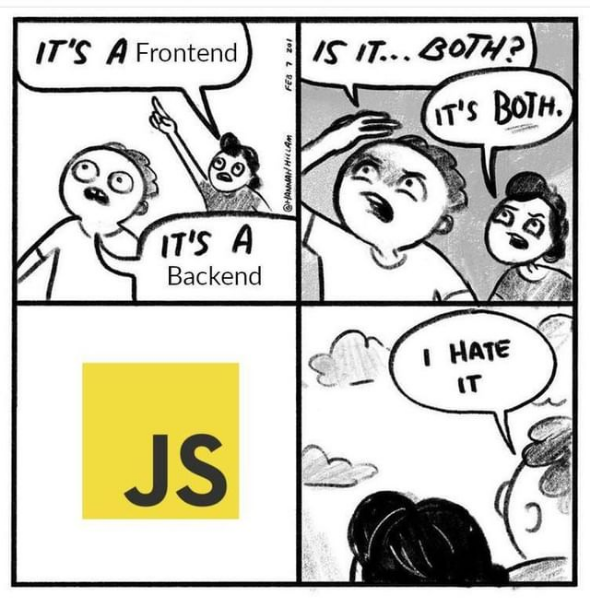

<!-- ## Hello there, I am Tarush Bajaj!

I am a 20 y/o senior, pursuing B.Tech in Computer Science and Artificial Intelligence at [Netaji Subhas University of Technology](http://www.nsit.ac.in/).

Expected 2023.

I like Memes, Finance and Game Theory.

## Connect with me:

[Linkedin &nbsp;](https://www.youtube.com/watch?v=dQw4w9WgXcQ)

## Languages I speak:

&ensp; JavaScript  &ensp;&nbsp;&nbsp;&nbsp;&nbsp; Python  &ensp; &nbsp;&nbsp;&nbsp;&nbsp;CPP 
 
 

| <h2>Frameworks I use </h2>                                                                                                                                                                                                                                                                                                                                                                                                                                                 | <h2>Other Skills</h2>                                                                                                                                                                                                                                                                                                                                                                                                      |
| -------------------------------------------------------------------------------------------------------------------------------------------------------------------------------------------------------------------------------------------------------------------------------------------------------------------------------------------------------------------------------------------------------------------------------------------------------------------------- | -------------------------------------------------------------------------------------------------------------------------------------------------------------------------------------------------------------------------------------------------------------------------------------------------------------------------------------------------------------------------------------------------------------------------- |
|  React  |  Git  |
|  React Native                                                                                                                                                                                                                                     |  Nodejs                                                                                                                                                                                         |
|  Express                                                                                                                                                                                                                                      |  Mongo                                                                                                                                                                                        |
|  Pandas                                                                                                                                                                                                                                                                  |  Canva                                                                                                                                                                                                                                                         |
|  Matplotlib                                                                                                                                                                                                                                                                                   |  Shell                                                                                                                                                                                            |

<!-- 

 -->
<!--  

## Connect with me for real 🙂 :

[Linkedin &nbsp;](www.linkedin.com/in/tarush-bajaj-564376198)

[GMail &nbsp;](mailto:tarushbajaj3@gmail.com)

<!--  -->
<!--  -->

  

  

    
    
    
    
    <!--  -->
    <!--  -->
    <!--  -->
    <!--  -->
    <!--  -->
    <!--  -->
     
    
    
    
    
  

  📣 Find me Here : 
  
  
  

I am a 20 y/o senior, pursuing B.Tech in Computer Science and Artificial Intelligence at [Netaji Subhas University of Technology](http://www.nsit.ac.in/).

Expected 2023.

I like Memes, Finance and Game Theory.

<h3>⚡️  ⚡️</h3> 

🧔 I am <bold>Tarush Bajaj</bold>.

🎓 21 y/o, Senior undergraduate at [Netaji Subhas University of Technology](http://www.nsit.ac.in/). Expected 2023.
 
💸 I like Memes, Finance and Game Theory.

💼 Resume: https://rebrand.ly/tarush_resume

💻 Software Developer

